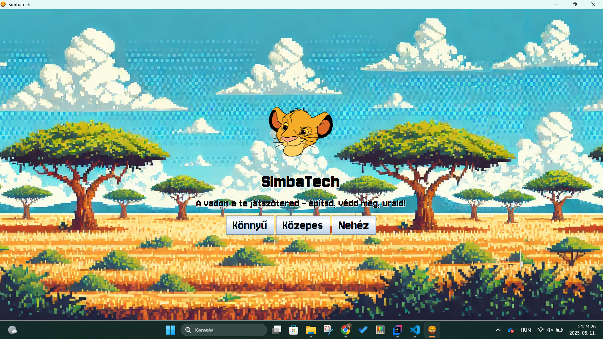
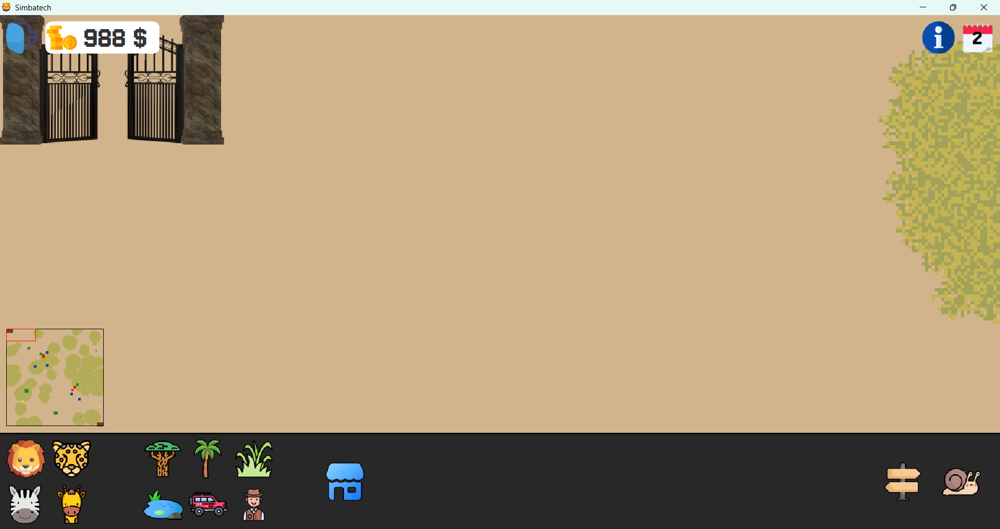
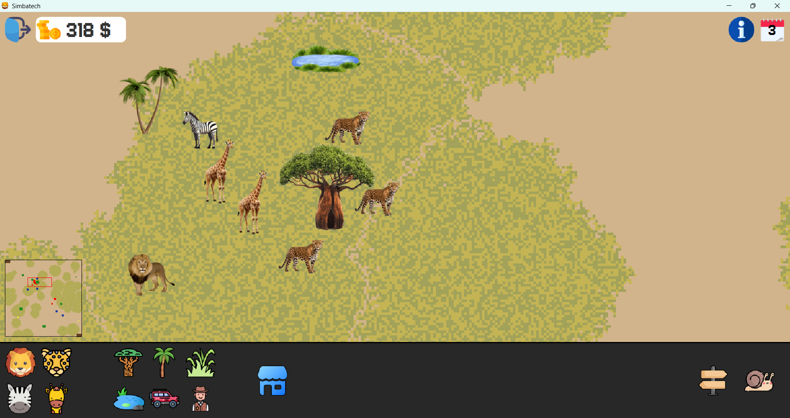
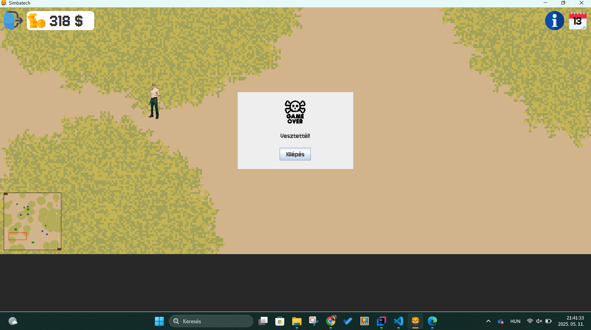

# SimbaTech

A SimbaTech egy szimulációs szafaris játék, amelynek a cél, hogy a pálya 
nehézségétől függően 3, 6 vagy 12 hónapig kell életben tartani a Szafariban 
élő állatokat.

## Miket lehet vásárolni?

A felhasználó pénzért vásárolhat:
### 1. Különböző állatokat:
+ Oroszlánt *(ragadozó)*
+ Leopárdot *(ragadozó)*
+ Zebra *(növényevő)*
+ Zsiráf *(növényevő)*

### 2. Különböző növényeket:

+ Majomkenyérfát
+ Pálmafát
+ Füvet

### 3. És egyéb dolgokat/embereket:

+ Vadőrt
+ Tavat
+ Dzsipet
+ Utakat (építeni)

## Hogyan lehet pénzt szerezni?
 1. Állatok, növények, vadőr, eszközök eladásával.
 2. Dzsipek (azaz turisták) általi fizetségből.

## Állatok

A szafariban szabadon élnek ragadozó és növényevő állatok. A növényevő állatok fákat, bokrokat,
füvet ehetnek, míg a ragadozók növényevő állatokat. Mindkét csoportnak szüksége van vízre is az
életben maradásához. Az állatok korlátozott ideig élnek, az idő előrehaladtával pedig öregszenek és
többet is esznek. Az állatok a saját fajtájuk csoportjában igyekeznek élni és vándorolni. A felnőtt
egyedeket tartalmazó csoportok képesek szaporodni. A jóllakott állatok órákig heverésznek, majd
kiválasztják a pálya egy pontját, ahova igyekeznek
eljutni, majd ezt ismétlik, amíg meg nem éheznek vagy szomjaznak. Az éhes vagy szomjas állatok
igyekeznek a már általuk felfedezett élelem vagy vízforráshoz eljutni.

## Orvadászok
Időnként megjelennek orvvadászok, akik próbálják az állatállományt vagy kedvtelésből kilőni. Az orvvadászok csak akkor látszanak, ha turisták vagy vadőrök
vannak a közelükben.

## A játék vége
A játékot akkor nyerjük meg, hogy ha elérjük, hogy a nehézségi szinttől függően 3, 6 vagy 12 egymást
követő hónapban a látogatók, a növényevő, a ragadozó állatok száma, és a tőkénk is egy küszöbérték
felett marad. A küszöbérték különböző a különböző kategóriáknál, pl. legalább 80 látogató, legalább
20 növényevő állat, stb. A játékot azonnal elveszítjük (az igazgatót kirúgják), ha csődbe megyünk,
vagy kipusztul az összes állat.

